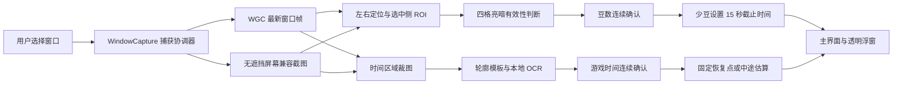

# Bean Studio 桌面版实现说明

本文说明 V5.7.2 本地修复包的工程设计、规则依据、实现取舍与验证边界，供维护和复现使用。版本历史见 [CHANGELOG.md](../CHANGELOG.md)，构建和操作见 [README.md](../README.md) 与 [USAGE.md](../USAGE.md)。内容依据当前源码和留存的版本说明整理，不把未实现方案写成现有功能。

## 1. 工具的边界与识别链路

本程序是独立的 C# / WinForms Windows x64 工具：获取指定窗口的图像，定位游戏顶部左右两组四格豆子，判断每格亮、暗或不确定，确认数量变化后设置 15 秒冷却。它不读取游戏内存，不注入游戏进程，不模拟游戏输入，不持续录屏，不把画面发送到云端。

当前豆子识别使用颜色、局部亮度、轮廓和连续确认规则；时间识别使用人工标注的数字轮廓模板及本地 Tesseract LSTM 预训练 OCR。V3 曾提供小型 MLP 训练工具，但它不等于 V5.7.2 已内置一个新训练的通用游戏模型。



豆子和游戏时间各有独立后台线程，悬浮窗也有独立界面线程。OCR 低优先级运行，避免把较慢的数字识别放进每次豆子判定中；这些线程共享窗口捕获协调器，不各自创建一套持续捕获会话。

## 2. 为什么先定位四格，再分别判断

`AutoLocator.cs` 先缩小顶部约 28% 的画面，缩小后宽度最高 1024 像素，在左右 HUD 的预期范围内寻找四个等距菱形。搜索使用血条、菱形中心与周围亮度差、间隔谷值及暗豆轮廓。血条检查包含豆子组之外的点，降低金色满豆火光被误当成血条的可能。

如果常规血条不可用，会尝试四个较强的菱形形状；紫色血条单独辅助定位，允许与另一侧存在一定高度差。低分辨率搜索只是产生候选，最终必须用原分辨率图像通过四格检测，不能因为找到两个亮点就直接报告两颗。

定位成功后将位置保存为客户区内的归一化区域，窗口移动时换算到新屏幕位置。来源、尺寸变化和主动扫描会重新定位。V5.7.2 增加持续失效约 0.45 秒后的限频重新验证（搜索后至少间隔约 1 秒），解决同尺寸 HUD 位置改变后永久沿用旧框的问题。只有所选侧四格全部有效的新位置才被采用；相同尺寸黑屏或遮挡找不到时保留旧框，截止时间不变。换框只忘记数量基准，重新连续确认，不追溯不可见期间的消耗。

确认 0 颗是独立有效状态，主界面和浮窗优先显示“对方已无豆”，增长后还原数字显示。空豆仍要求四个完整暗菱形满足既有门槛；Invalid 和无画面不能当成 0。最后一豆消耗设置的截止时间与以往一致，无豆提示仅改变展示，不取消计时。

左右切换只选定另一组区域并重建数量基准，不把两侧的差异当成一次消费。悬浮窗和主窗同步选择，重复选择当前侧由界面避免无意义地重置基准。

## 3. 蓝、金、紫色与满豆火光

`Detector.Analyze` 把目标区域等分四格，每格只在自身范围内做约 ±8% 的小范围位置搜索，不跳到邻格补数。小区域像素通过 `LockBits` 一次复制到 `PixelMap`，避免逐像素调用大量 GDI+ `GetPixel`。

亮豆判断综合中心的蓝青、金橙、紫色和近白发光信号、达到亮度门槛的像素比例，以及中心与四角背景的对比。默认亮度门槛为 150，但它不是唯一条件。

暗豆必须有可解释的颜色和结构。`DarkGemShape.cs` 使用蓝减绿通道、中心与侧缘差异、上下对称性和范围约束，减少红色退场效果或背景亮度的干扰。紫色空槽补充检查五点深色中心和六点较亮紫色边缘；单个发光点不直接代表空槽。

满四颗时火光会改变形状和亮度，因此紫色强光还检查紫色通道对比；不能单纯把高亮、轮廓变化解释成数量变化。当前规则有明确的亮、暗接受区间，也保留不确定区间。任意一格未通过有效性检查，本帧整组数量就不参加计时判断。

四个清晰暗豆可以确认成 `0 / 4`；黑屏、遮挡、裁切不全或颜色不足属于未知。这两个状态必须分开，否则技能黑屏会造成假消费。

## 4. 豆数变化与 15 秒计时

计时状态机在 `BeanTimer.cs` 的 `Counter` 中：

| 观察结果 | 行为 |
| --- | --- |
| 初次连续确认数量 | 建立基准，不启动计时 |
| 比基准少 | 从确认时刻重新设置完整 15.000 秒，正在计时也重置 |
| 比基准多 | 更新基准，保留原冷却，不触发 |
| 与基准相同 | 保持，不反复触发 |
| 无效帧 | 不改截止时间；连续未知约 0.7 秒后忘记数量基准 |
| 手动清除计时 | 清除截止时间与基准 |
| 暂停监测、切换侧或重新配置 | 重建基准；已存在冷却继续 |

变化需至少三个连续有效样本：建立基准或减少还需持续至少 40 ms，增长需至少 120 ms。增长确认更慢是因为短暂假增长 `3→4→3` 会把最后的恢复误判成减少，从而让倒计时跳回 14 秒；加长增长确认可过滤部分这种抖动。真正持续增长后再次减少仍可重置。

截止时间使用 `Stopwatch` 单调时钟，公式为 `deadline = 确认时刻 + 15.000`，显示为 `max(0, deadline - 当前时刻)`。不依赖界面每次固定减数，因此 UI 短时繁忙不会把一轮 15 秒拉长。显示两位小数只是显示精度，不是采样或物理显示器的精度保证。

无效帧不自动作废计时。V5.1 曾加入“识别不到就清零”，但技能黑屏与换局不能仅凭区域消失可靠区分，V5.2 已移除。当前长期失去画面仅忘记基准，恢复后先确认现有数量，不追溯未知期间消费了几次。

## 5. 游戏时间为什么有时未确认

时间识别并非只读一个数字：它要同时通过取帧、区域、完整数字布局、单字匹配和连续读数检查。任一阶段不可靠都会显示未确认。训练模式没有中间时钟、区域切掉小数尾部、特效盖住数字、分辨率过小，以及模板不覆盖的轮廓都可能失败。

`GameClock.cs` 默认读取顶部中间归一化区域。校准页能展示实际局部图、原始读数、确认读数、失败原因、识别路径和本帧匹配分数，并允许保存 `clock-region.txt`。框选应包括低于 10 秒时完整小数，避开上方“第几回”；校准大图是静态扫描图，下方局部图来自最近采集。

### 数字处理

1. 用红色轮廓、浅色填充等生成连通组件；普通轮廓无可靠读数后才使用弱光轮廓。
2. 根据大小、间距和对齐筛选数字，弱光路径可合并符合约束的小字碎片。
3. 校验完整两位整数，或一位较大整数、小数点、两位较小小数的布局。不会因为只认出 `6` 就把 `6.43` 当成整数。
4. 每个数字归一化成 24×40 二值轮廓。模板使用交并比、第一与第二候选的分差接受；小字路径允许严格的一像素边缘容差，并要求更强分差。
5. 模板不够明确时尝试本地 Tesseract LSTM 单字 OCR，限制数字字符、尝试次数和继续尝试的时间预算。预算不是一次原生 OCR 调用的硬实时截止保证。
6. 多种完整读法接近时拒绝该帧。只有 0–60 范围内的完整读法可以参加连续确认；小于 10 的单独整数不代替应有的小数布局。

模板缺失或 OCR 初始化失败会降低覆盖率。OCR 失败时能保留模板路径，但模板成功只代表已有轮廓能匹配，不等于所有数字和特效都已覆盖。`clock-templates.txt` 来自人工标注样本，匹配分数和 OCR 分数都不是经过实战校准的正确率。

### 连续确认与时效

`ClockTracker` 不按现实时间推算游戏时间，因为技能演出可能暂停游戏时钟。相同新鲜值可以刷新确认时间；正常下降一般需两帧，新鲜确认值附近的大跳变需三帧。候选之间还要满足时间间隔及下降幅度约束。

空帧不会刷新旧值的时效。界面可以保留历史信息，但恢复点计算只接受时效范围内的确认值。这样会牺牲部分立刻给出数字的机会，换取减少单帧误读污染计时提示。

## 6. 恢复点与两个时钟

大数字表示现实时间 15 秒冷却，游戏时间来自截图；两者不能假设永远同速。

少豆确认时，若有足够新鲜的游戏时间 `T`，固定显示 `T - 15`。例如少豆时为 49 秒，提示恢复点 34 秒；剩余不足 15 秒则直接提示本回合不足。恢复点固定保留到下一次少豆或清除，不每帧跟着大数字变动。

若触发瞬间没读到时间，先请求短暂补读。实现接受触发前约 0.6 秒内，或触发后约 0.2 秒内采到的确认值；后者标为 `≈`。短暂补读最多等待约 0.25 秒，这不是整体识别延迟保证。

短暂补读仍失败时，后续冷却中若得到确认值且读数年龄不超过约 0.2 秒，可补算一次 `当前游戏时间 - 剩余现实冷却`，标为“中途补算”并固定。例如当前为 40 秒、冷却还剩 8 秒，显示约 32 秒。由于游戏可能暂停且整数有取整误差，这个提示是估算，不伪装成精确游戏冷却。

没有可靠读数时保留未确认，不默认猜 60，不新增一套 D 键 60 秒计时。

## 7. 窗口捕获、遮挡和性能

### 获取方式

`WindowCapture.cs` 统一协调捕获。优先由 `WindowFrames.cs` 使用 Windows Graphics Capture：通过窗口句柄创建 `GraphicsCaptureItem`，建立 D3D11 设备和双缓冲 `CreateFreeThreaded` 帧池。普通其他窗口覆盖目标时，这条路径通常仍能取得目标窗口自己的图像。

帧内容经 `SoftwareBitmap.CreateCopyFromSurfaceAsync` 读回 CPU，重复使用像素缓冲与最近一帧 `Bitmap`，再按屏幕坐标和 DWM 窗框范围裁出区域。超过约 0.3 秒未更新的 WGC 帧不能直接当作新观测；窗口尺寸变化也要求新帧。

WGC 失败或暂未给出可用帧时，兼容路径使用 `Graphics.CopyFromScreen`。它实际截取屏幕区域，所以必须检查目标未最小化、区域在屏幕内且密集网格点未被其他窗口覆盖。兼容路径不会把其他窗口上的内容冒充目标图像。

WGC 不能恢复游戏画面内部被菜单、技能或黑屏覆盖的内容；最小化、源停止渲染、受保护内容和图形驱动问题也可能没有新帧。

### V5.7.1 的新帧调度修复

旧实现读回忙时直接丢弃 `FrameArrived` 通知。帧池仍可能留下未消费帧，而此时没有后续消费任务，造成采集停滞。在本机同一合成窗口检查中，修复前持续重绘 10 秒仅完成一帧。

新实现用 `pending` 记录处理期间来的通知，用 `busy` 保证同一时间只有一个消费者；每次排空积压帧并释放旧帧，只对最新帧做 CPU 读回。消费者结束释放 `busy` 后再检查 `pending`，覆盖结束边界上的通知竞态。它减少积压帧造成的陈旧读数，并保持后续消费任务。

### 尚存在的开销

识别仅处理小 ROI，不代表 WGC 只复制这个 ROI：当前 GPU 到 CPU 的读回仍是整个目标窗口。高分辨率窗口的读回、内存复制、锁等待及透明浮窗重绘可能增加系统负载。豆子线程运行时目标循环约 8 ms、时钟线程约 50 ms；这些是目标周期，不是实测帧率或端到端延迟。

主界面不看预览并不会自动关闭这些后台工作。暂停修复解决了明确的持续采集缺陷，但没有证明它是 MuMu 鼠标卡顿的唯一原因，也没有用真实游戏测量 CPU、GPU 峰值或鼠标响应。

## 8. V5.7.1 如何实现真正暂停

旧版按钮主要禁用了少豆触发：豆子线程仍低频取帧，时钟线程继续 OCR，WGC 会话继续产生和读回窗口帧。用户点击暂停后负载仍存在，符合这个代码缺陷。

V5.7.1 将暂停作为全链路状态：

1. `Engine.SetPaused` 禁止触发、忘记旧豆数、增加配置版本，但保留单调时钟截止时间。
2. `WindowCapture.SetPaused` 建立全局暂停屏障。`Prepare`、`Available`、`Capture` 和兼容截图路径检查屏障，不能因为左右切换、区域修改或线程尾部调用重新创建会话。
3. 捕获协调器递增 `generation`，分离已有帧会话，等待串联的停止与初始化任务后释放资源。过期初始化结果只能释放，不能重新挂回当前会话。
4. 豆子和时间线程完成已经开始的工作后进入事件等待，不继续轮询取帧。结果提交时检查配置版本，防止暂停前的在途结果更新新状态。
5. 界面只有在豆子线程空闲、时间线程空闲、捕获停止任务成功完成三者都满足后，才显示“捕获与识别已停止”。停止异常不会冒充成功。
6. 暂停时主界面和浮窗刷新约降到 100 ms；已有冷却仍按原截止时间下降。

暂停中的手动扫描只取一次经过无遮挡检查的屏幕截图，不重新开启持续 WGC；切换左右、修改区域或 `Refresh` 不取消暂停。恢复时允许重新创建捕获会话并建立新的豆数、时间基准，不把暂停期间变化补成消费。

暂停完成是一个生命周期条件，不是点按钮瞬间就能宣称所有原生调用已经结束。正在进行的 GPU 读回或 OCR 可能要先返回；资源释放完成才更新最终状态。

## 9. 资源、隐私与诊断

缓存有明确数量上限：豆子局部图最多 120 张，约每 100 ms 保存一张到内存；豆子日志最多 1500 条；时间失败局部图最多 20 张且最多每 0.5 秒缓存一张，时间记录最多 400 条。实际覆盖秒数取决于能否持续采样，不能只凭图片数量证明延迟。

被替换的局部图、超出队列上限的图片、当前 WGC 帧、软件位图、OCR `Pix/Page` 和透明窗绘制所用 GDI 对象均有释放路径。关闭时如果线程未在初始等待内退出，会继续后台等待后清理缓冲，避免直接跳过清理。

正常监测不持续写临时图片。主动保存诊断、保存时间校准、构建依赖缓存或启动错误日志才会写到相应程序目录。保存诊断会把局部图和记录导出到新的文件夹；它不自动上传，用户自行保留或删除。公开仓库不附用户原图、个人诊断和训练数据。

“有界缓存”和短时检查不是长期无泄漏证明。尚未做真实 MuMu 多小时、不同显卡驱动及反复来源变化的压力测试，不宣称任何环境绝无内存或原生资源泄漏。

## 10. 交互与界面取舍

主界面按连接、游戏画面、冷却、时间、识别状态划分信息，主操作为“开始监测”。“悬浮倒计时”先打开菜单，避免直接隐藏主窗造成无从返回。圆角自绘和明亮边缘借鉴玻璃质感，但不是苹果系统原生 Liquid Glass。

浮窗为 216×112 的逐像素透明置顶窗口，背景与文字独立控制透明度。常态青蓝，最后 5 秒逐步转向橙红，文字加深色描边以适应亮色技能画面。保留左右按钮、拖动和双击返回，因此没有全窗鼠标穿透。

布局对最小化、初始化未完成或无效尺寸做防护，字号有正数下限，避免旧版 `emSize = -363.55` 异常。UI 刷新频率与判定频率分离，界面不会决定一轮计时的长度。

## 11. 可以复现什么，尚不能证明什么

V5.7.1 于 2026-10-05 本地构建产物通过 20 项暂停/恢复及真实 WGC 合成窗口检查、12 项时钟状态检查。20 项检查包括实际完成窗口帧复制和非空裁图、动画持续时暂停采样不增长、左右/区域配置不复活采集、恢复采样、各 8 轮初始化竞态与重复暂停恢复、已有冷却保留以及按钮接线和暂停界面渲染。

这些检查捕获的是程序自建动态测试窗口，不操作 MuMu，不测真实游戏鼠标延迟。12 项时钟检查主要验证状态逻辑，不测截图识别准确率。详细当前结果见 [验证结果.txt](../验证结果.txt)。

构建并运行状态检查：

```powershell
powershell -NoProfile -ExecutionPolicy Bypass -File .\build.ps1
powershell -NoProfile -ExecutionPolicy Bypass -File .\scripts\test.ps1 -SkipBuild
```

在普通 Windows 桌面会话运行捕获检查；它会短暂显示自己的合成窗口：

```powershell
$report = Join-Path $PWD 'artifacts\tests\pause'
$test = Start-Process -FilePath .\BeanStudio.exe -WorkingDirectory $PWD `
    -ArgumentList @('--pause-test', ('"{0}"' -f $report)) `
    -WindowStyle Hidden -Wait -PassThru
$test.Refresh()
Get-Content (Join-Path $report '暂停回归验证.txt') -Encoding UTF8
if ($test.ExitCode -ne 0) { throw '暂停检查失败，请查看报告。' }
```

历史 V5.7 的保存图片及变换集合共 64 项通过，其中 24 个负样本保持未确认；部分样本参与过模板来源，因此不能作为独立实战准确率。保存图片变化、状态测试、合成屏幕链路和真实多局游戏各测不同问题，不能把它们累加成“准确率 100%”。

当前不承诺零误识别或始终低于 200 ms 的真实游戏端到端延迟。真实使用应完全退出旧版，分别对比监测中、暂停完成后和完全退出三个状态，保留同一失效场景的捕获状态、局部图与读数日志，再判断瓶颈在采集、区域、数字分割、匹配还是连续确认。

## 12. 后续研究方向（尚未实现）

以下是可继续研究的选项，不是 V5.7.2 已有能力：

- 在 GPU 端先裁出豆子和时钟区域，再分离读回锁，减少高分辨率全窗口复制。
- 根据源的新帧节奏调整识别周期，增加读回、锁等待、OCR 和绘制分段指标，用真实 MuMu 对照测量性能。
- 收集不同对局、角色、颜色、数字及特效的已授权样本；按局隔离训练、验证与最终测试，避免相邻帧泄漏。
- 对固定位置豆子三分类或完整数字序列训练专用模型，同时保留未知类别、时效约束及错误拒绝机制。
- 将豆子误触发、漏触发、时间接受率、接受读数错误率及端到端延迟分别统计；单一分类准确率不足以说明计时体验。

当前版本优先修复可定位的缺陷并保留诊断能力，不通过降低所有门槛或猜时间来制造“总能识别”的表象。
